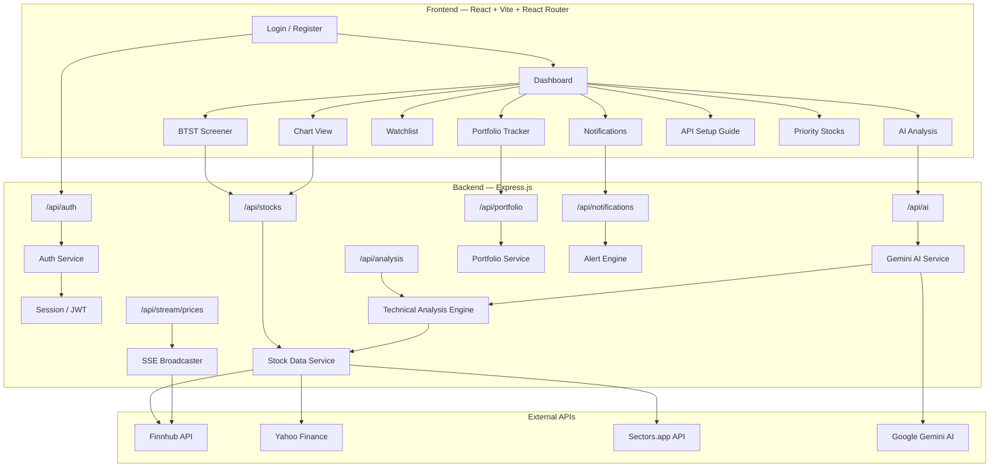

# Bot Saham — Stock Trading Analysis App

Real-time web application for stock trading analysis with **Buy Today, Sell Tomorrow (BTST)** strategy. Powered by AI assistant for market analysis and automated technical indicators.

> **⚠️ Disclaimer**: This application is an **analysis tool** and not investment advice. All trading decisions remain the user's responsibility. Technical indicators are lagging and do not guarantee future results.

---

## Table of Contents

- [Architecture Overview](#architecture-overview)
- [Tech Stack](#tech-stack)
- [Project Structure](#project-structure)
- [Setup & Configuration](#1-project-setup--configuration)
- [Design System](#2-design-system--styling)
- [Authentication System](#3-authentication-system)
- [Backend Services](#4-backend-services)
- [API Routes](#5-api-routes-expressjs)
- [Frontend Components](#6-frontend-components)
- [Pages](#7-pages-react-router)
- [State Management](#8-state-management)
- [Feature Summary](#feature-summary)
- [Verification Plan](#verification-plan)

---

## Architecture Overview



---

## Tech Stack

| Layer                  | Technology                         | Reason                                              |
| :--------------------- | :--------------------------------- | :-------------------------------------------------- |
| **Frontend Framework** | React 19 + Vite                    | Fast HMR, lightweight, modern bundling              |
| **Routing**            | React Router v7                    | Client-side routing, nested layouts, loaders        |
| **Backend**            | Express.js + TypeScript            | Flexible API server, middleware support, SSE native |
| **Language**           | TypeScript                         | Type safety for financial data                      |
| **Styling**            | Vanilla CSS + CSS Variables        | Flexible, dark mode, glassmorphism                  |
| **Charts**             | Lightweight Charts (TradingView)   | High performance, native candlestick, real-time     |
| **State**              | Zustand                            | Lightweight, performant                             |
| **Data Fetching**      | TanStack Query (React Query)       | Caching, polling, loading/error states              |
| **Real-time**          | SSE (Server-Sent Events)           | Efficient for read-only price streaming             |
| **AI**                 | Google Gemini Flash API            | Free tier, function calling, text analysis          |
| **Technical Analysis** | technicalindicators (npm)          | RSI, MACD, EMA, Bollinger Bands                     |
| **Stock Data**         | Finnhub + Yahoo Finance            | Real-time quotes + historical candles               |
| **IDX Data**           | Sectors.app API                    | Indonesian stock market data                        |
| **Authentication**     | JWT + httpOnly cookies + bcrypt    | Secure session, password hashing, token-based auth  |
| **Notifications**      | Browser Notifications API + in-app | Alert on strong signals                             |
| **Persistence**        | LocalStorage + JSON file (server)  | Watchlist, portfolio, preferences                   |

---

## Project Structure

```
bot-saham/
├── client/                          # React Frontend (Vite)
│   ├── public/
│   ├── src/
│   │   ├── assets/                  # Static assets
│   │   ├── components/
│   │   │   ├── auth/
│   │   │   │   ├── AuthGuard.tsx       # Protected route wrapper
│   │   │   │   ├── AdminGuard.tsx      # Admin-only route wrapper
│   │   │   │   ├── LoginForm.tsx
│   │   │   │   └── RegisterForm.tsx
│   │   │   ├── users/
│   │   │   │   ├── UsersTable.tsx
│   │   │   │   └── UserFormModal.tsx
│   │   │   ├── layout/
│   │   │   │   ├── Sidebar.tsx
│   │   │   │   ├── Header.tsx
│   │   │   │   └── AppLayout.tsx
│   │   │   ├── charts/
│   │   │   │   ├── CandlestickChart.tsx
│   │   │   │   └── MiniChart.tsx
│   │   │   ├── stock/
│   │   │   │   ├── StockCard.tsx
│   │   │   │   └── StockDetail.tsx
│   │   │   ├── screener/
│   │   │   │   └── ScreenerTable.tsx
│   │   │   ├── ai/
│   │   │   │   └── AIAnalysisPanel.tsx
│   │   │   ├── portfolio/
│   │   │   │   ├── PortfolioTable.tsx
│   │   │   │   └── AddTransactionModal.tsx
│   │   │   ├── notifications/
│   │   │   │   ├── NotificationCenter.tsx
│   │   │   │   └── AlertRuleForm.tsx
│   │   │   ├── indicators/
│   │   │   │   ├── RSIGauge.tsx
│   │   │   │   └── MACDChart.tsx
│   │   │   └── common/
│   │   │       ├── LivePrice.tsx
│   │   │       └── ScoreBadge.tsx
│   │   ├── pages/
│   │   │   ├── Login.tsx
│   │   │   ├── Register.tsx
│   │   │   ├── Dashboard.tsx
│   │   │   ├── Screener.tsx
│   │   │   ├── StockDetailPage.tsx
│   │   │   ├── AIAnalysis.tsx
│   │   │   ├── Portfolio.tsx
│   │   │   ├── Notifications.tsx
│   │   │   ├── PriorityStocks.tsx
│   │   │   ├── ApiGuide.tsx
│   │   │   └── UserManagement.tsx
│   │   ├── hooks/
│   │   │   ├── useSSE.ts
│   │   │   ├── useStockData.ts
│   │   │   └── useNotifications.ts
│   │   ├── store/
│   │   │   ├── useAuthStore.ts
│   │   │   ├── useStockStore.ts
│   │   │   ├── usePortfolioStore.ts
│   │   │   └── useNotificationStore.ts
│   │   ├── styles/
│   │   │   └── globals.css
│   │   ├── types/
│   │   │   └── index.ts
│   │   ├── App.tsx
│   │   └── main.tsx
│   ├── index.html
│   ├── vite.config.ts
│   ├── tsconfig.json
│   └── package.json
│
├── server/                          # Express.js Backend
│   ├── src/
│   │   ├── routes/
│   │   │   ├── auth.ts
│   │   │   ├── users.ts
│   │   │   ├── stocks.ts
│   │   │   ├── analysis.ts
│   │   │   ├── ai.ts
│   │   │   ├── portfolio.ts
│   │   │   ├── notifications.ts
│   │   │   └── stream.ts
│   │   ├── services/
│   │   │   ├── auth.ts
│   │   │   ├── user-management.ts
│   │   │   ├── finnhub.ts
│   │   │   ├── yahoo-finance.ts
│   │   │   ├── sectors.ts
│   │   │   ├── technical-analysis.ts
│   │   │   ├── gemini-ai.ts
│   │   │   ├── portfolio.ts
│   │   │   └── alert-engine.ts
│   │   ├── middleware/
│   │   │   ├── authMiddleware.ts
│   │   │   ├── adminMiddleware.ts
│   │   │   ├── rateLimiter.ts
│   │   │   └── errorHandler.ts
│   │   ├── types/
│   │   │   └── index.ts
│   │   ├── data/                    # JSON file persistence
│   │   │   ├── users.json
│   │   │   ├── sessions.json
│   │   │   ├── portfolio.json
│   │   │   ├── watchlist.json
│   │   │   └── alerts.json
│   │   └── index.ts                 # Express entry point
│   ├── tsconfig.json
│   └── package.json
│
├── .env.example                     # Environment variables template
├── .gitignore
├── package.json                     # Root workspace config
├── IMPLEMENTATION_PLAN.md           # This file
└── README.md
```

---

## Proposed Changes

### 1. Project Setup & Configuration

#### Root Workspace

- Monorepo with npm workspaces (`/client` + `/server`)
- Shared TypeScript config
- Single `npm run dev` command to start both client and server concurrently (using `concurrently` package)

#### Client — Vite + React + React Router

- Initialize with: `npx create-vite client --template react-ts`
- Install dependencies:
  ```
  react-router-dom
  lightweight-charts
  @tanstack/react-query
  zustand
  ```

#### Server — Express.js + TypeScript

- Express.js with TypeScript (using `tsx` for development)
- Install dependencies:
  ```
  express cors dotenv cookie-parser
  jsonwebtoken bcryptjs uuid
  @google/generative-ai
  technicalindicators
  yahoo-finance2
  ```

#### Environment Variables (`.env.example`)

```env
# Stock Data APIs
FINNHUB_API_KEY=your_key_here
SECTORS_API_KEY=your_key_here

# AI
GEMINI_API_KEY=your_key_here

# Authentication
JWT_SECRET=your_random_secret_key_here
JWT_REFRESH_SECRET=your_random_refresh_secret_here
JWT_EXPIRY=15m
JWT_REFRESH_EXPIRY=7d
SESSION_COOKIE_NAME=bot_saham_session

# Server
PORT=3001
CLIENT_URL=http://localhost:5173
```

---

### 2. Design System & Styling

#### `client/src/styles/globals.css`

- Dark theme primary (trading app aesthetic)
- CSS Variables for color palette:
  - Background: Deep navy/dark (`#0a0e27`, `#131738`)
  - Accent: Electric blue (`#3b82f6`), Cyan (`#06b6d4`)
  - Profit: Emerald green (`#10b981`)
  - Loss: Rose red (`#ef4444`)
  - Text: White/gray scale
- Glassmorphism cards (`backdrop-filter`, semi-transparent backgrounds)
- Micro-animations (pulse for live data, glow effects)
- Responsive grid system
- Custom scrollbar styling
- Typography: Inter font from Google Fonts

---

### 3. Authentication System

#### `server/src/services/auth.ts`

Authentication service handling user management and token operations:

- `register(email, password, name)` — Create new user account
  - Validate email format & password strength (min 8 chars, 1 uppercase, 1 number)
  - Hash password with `bcryptjs` (12 salt rounds)
  - Store user in `server/src/data/users.json`
  - Return JWT access token + refresh token
- `login(email, password)` — Authenticate existing user
  - Verify email exists
  - Compare password hash with `bcrypt.compare()`
  - Generate JWT access token (15min) + refresh token (7 days)
  - Store session in `server/src/data/sessions.json`
- `logout(sessionId)` — Invalidate session
  - Remove session from sessions store
  - Clear httpOnly cookie on client
- `refreshToken(refreshToken)` — Issue new access token
  - Verify refresh token is valid and not expired
  - Check session is still active
  - Return new access token
- `getProfile(userId)` — Get user profile data
- `updateProfile(userId, data)` — Update user name/email
- `changePassword(userId, oldPassword, newPassword)` — Change password with old password verification

**User Data Model:**

```typescript
type UserRole = "admin" | "user";

interface User {
  id: string; // UUID
  email: string;
  name: string;
  role: UserRole; // 'admin' or 'user'
  passwordHash: string; // bcrypt hashed
  isActive: boolean; // Account enabled/disabled
  createdAt: string; // ISO date
  updatedAt: string;
  lastLoginAt: string | null;
}

interface Session {
  id: string; // UUID
  userId: string;
  refreshToken: string;
  userAgent: string;
  ipAddress: string;
  createdAt: string;
  expiresAt: string;
  isActive: boolean;
}
```

#### User Seeder & Initial Data

To enable immediate testing and deployment, the server will implement an automated seeder that initializes default accounts on first run (if `server/src/data/users.json` does not exist or is empty):

- **Automatic Seeding**: Triggered at server startup inside `server/src/index.ts`.
- **Pre-hashed Passwords**: The seeder will pre-hash passwords using `bcryptjs` so that they are secure and ready for immediate login.

**Seeder Data:**

| Name | Email | Password | Role | Account Status |
|:---|:---|:---|:---|:---|
| **System Admin** | `admin@botsaham.com` | `Admin123!` | `admin` | Active |
| **Demo Trader** | `trader@botsaham.com` | `Trader123!` | `user` | Active |

#### `server/src/middleware/authMiddleware.ts`

Express middleware for protecting routes:

- `requireAuth` — Verify JWT from httpOnly cookie or Authorization header
  - Extract token from `req.cookies[SESSION_COOKIE_NAME]` or `Bearer` header
  - Verify token with `jsonwebtoken.verify()`
  - Attach `req.user = { id, email, name, role }` to request
  - Return `401 Unauthorized` if token invalid/expired
- `optionalAuth` — Same as `requireAuth` but does not reject if no token
  - Sets `req.user = null` if no valid token
  - Useful for public routes that show extra data for logged-in users

#### `server/src/middleware/adminMiddleware.ts`

Admin-only middleware (must be used after `requireAuth`):

- `requireAdmin` — Check if authenticated user has `role === 'admin'`
  - Return `403 Forbidden` if user is not admin
  - Must be chained after `requireAuth` middleware

**Protected Route Pattern:**

```typescript
// Public routes (no auth needed)
router.use("/api/auth", authRoutes);
router.use("/api/stocks", optionalAuth, stockRoutes);

// Authenticated routes
router.use("/api/portfolio", requireAuth, portfolioRoutes);
router.use("/api/alerts", requireAuth, notificationRoutes);

// Admin-only routes
router.use("/api/users", requireAuth, requireAdmin, userRoutes);
```

#### `server/src/services/user-management.ts`

Admin service for managing all users:

- `getAllUsers(page, limit, search, role, status)` — Paginated user list with filters
- `getUserById(id)` — Get single user details (without passwordHash)
- `createUser(email, password, name, role)` — Admin creates a new user
- `updateUser(id, data)` — Update user name, email, role
- `toggleUserStatus(id)` — Enable/disable user account
- `resetUserPassword(id, newPassword)` — Force reset user password
- `deleteUser(id)` — Permanently delete user account + all associated data
- `getUserStats()` — Total users, active users, admins count, new users this month

---

### 4. Backend Services

#### `server/src/services/finnhub.ts`

- `getQuote(symbol)` — Real-time price (current, high, low, open, prev close)
- `getCandles(symbol, resolution, from, to)` — Historical OHLCV data
- `searchSymbol(query)` — Stock symbol search
- `getMarketNews()` — Latest market news
- Rate limiting handler (60 req/min free tier)

#### `server/src/services/yahoo-finance.ts`

- `getHistoricalData(symbol, period)` — Historical data (1d, 5d, 1mo, 3mo, 6mo, 1y)
- `getQuote(symbol)` — Current quote + market cap, volume, P/E
- Fallback data source when Finnhub rate limit hit

#### `server/src/services/sectors.ts`

- `getIDXStocks()` — List all IDX stocks
- `getStockData(ticker)` — IDX stock fundamental + price data
- `getSectorPerformance()` — Sector overview

#### `server/src/services/technical-analysis.ts`

Technical indicator calculations using `technicalindicators` library:

- **RSI (14-period)** — Overbought/oversold detector
- **MACD (12, 26, 9)** — Momentum & trend direction
- **EMA (9, 21, 50)** — Short/mid/long term trend
- **Bollinger Bands (20, 2)** — Volatility range
- **Volume Analysis** — Volume spike detection
- **BTST Score Calculator** — Combined scoring algorithm:
  ```
  Score = (RSI_score × 0.25) + (MACD_score × 0.30) + (EMA_score × 0.20) + (Volume_score × 0.15) + (BB_score × 0.10)
  ```

  - RSI 40-60 = high score (momentum zone)
  - MACD bullish crossover = high score
  - Price > EMA50 = trend confirmation
  - Volume > avg = liquidity confirmation
  - Near lower BB = potential bounce

#### `server/src/services/gemini-ai.ts`

- `analyzeStock(symbol, historicalData, indicators)` — Comprehensive analysis
- `getMarketSentiment(news)` — Market sentiment from news
- `explainSignal(signal, data)` — Signal explanation in English
- Prompt engineering for trading context
- Structured output (JSON) for UI integration

#### `server/src/services/portfolio.ts`

- `addTransaction(transaction)` — Record buy/sell transaction
- `getPortfolio()` — Current holdings with P&L
- `getTransactionHistory()` — All past transactions
- `getPerformanceSummary()` — Total P&L, win rate, avg return
- JSON file persistence (`server/src/data/portfolio.json`)

#### `server/src/services/alert-engine.ts`

- `createAlert(rule)` — Create price/indicator alert rule
- `checkAlerts(quotes)` — Evaluate all active rules against current data
- `getActiveAlerts()` — List active alert rules
- Alert types:
  - Price above/below threshold
  - BTST score above threshold
  - RSI overbought/oversold
  - MACD crossover detected
  - Volume spike detected

---

### 5. API Routes (Express.js)

#### `server/src/routes/auth.ts` — 🔓 Public

| Method | Endpoint                 | Description                                                 |
| :----- | :----------------------- | :---------------------------------------------------------- |
| POST   | `/api/auth/register`     | Register new user (email, password, name)                   |
| POST   | `/api/auth/login`        | Login with email & password, returns JWT in httpOnly cookie |
| POST   | `/api/auth/logout`       | Logout, clears session cookie                               |
| POST   | `/api/auth/refresh`      | Refresh access token using refresh token                    |
| GET    | `/api/auth/me`           | Get current authenticated user profile (🔒 requires auth)   |
| PUT    | `/api/auth/profile`      | Update user profile (🔒 requires auth)                      |
| PUT    | `/api/auth/password`     | Change password (🔒 requires auth)                          |
| GET    | `/api/auth/sessions`     | List active sessions (🔒 requires auth)                     |
| DELETE | `/api/auth/sessions/:id` | Revoke a specific session (🔒 requires auth)                |

#### `server/src/routes/users.ts` — 🔒 Admin Only (requireAuth + requireAdmin)

| Method | Endpoint                        | Description                                             |
| :----- | :------------------------------ | :------------------------------------------------------ |
| GET    | `/api/users`                    | List all users (paginated, searchable, filterable)      |
| GET    | `/api/users/stats`              | User statistics (total, active, admins, new this month) |
| GET    | `/api/users/:id`                | Get single user details                                 |
| POST   | `/api/users`                    | Create new user (admin sets role)                       |
| PUT    | `/api/users/:id`                | Update user (name, email, role)                         |
| PATCH  | `/api/users/:id/status`         | Toggle user active/inactive                             |
| PATCH  | `/api/users/:id/reset-password` | Force reset user password                               |
| DELETE | `/api/users/:id`                | Delete user + all associated data                       |

#### `server/src/routes/stocks.ts` — 🔓 Public (optionalAuth)

| Method | Endpoint                                     | Description            |
| :----- | :------------------------------------------- | :--------------------- |
| GET    | `/api/stocks/quote?symbol=BBRI.JK`           | Single stock quote     |
| GET    | `/api/stocks/candles?symbol=AAPL&period=1mo` | Historical candle data |
| GET    | `/api/stocks/search?q=bank`                  | Search stocks          |
| GET    | `/api/stocks/market-movers?market=idx`       | Top gainers/losers     |

#### `server/src/routes/analysis.ts` — 🔒 Protected (requireAuth)

| Method | Endpoint                   | Description                           |
| :----- | :------------------------- | :------------------------------------ |
| POST   | `/api/analysis`            | Technical analysis for specific stock |
| GET    | `/api/screener?market=idx` | BTST screener with ranked results     |

#### `server/src/routes/ai.ts` — 🔒 Protected (requireAuth)

| Method | Endpoint            | Description                         |
| :----- | :------------------ | :---------------------------------- |
| POST   | `/api/ai/analyze`   | AI-powered stock analysis           |
| POST   | `/api/ai/sentiment` | Market sentiment analysis from news |

#### `server/src/routes/portfolio.ts` — 🔒 Protected (requireAuth, user-scoped)

| Method | Endpoint                         | Description                           |
| :----- | :------------------------------- | :------------------------------------ |
| GET    | `/api/portfolio`                 | Get current user's portfolio holdings |
| POST   | `/api/portfolio/transaction`     | Add buy/sell transaction              |
| GET    | `/api/portfolio/history`         | Transaction history (current user)    |
| GET    | `/api/portfolio/performance`     | P&L summary (current user)            |
| DELETE | `/api/portfolio/transaction/:id` | Delete transaction (owner only)       |

#### `server/src/routes/notifications.ts` — 🔒 Protected (requireAuth, user-scoped)

| Method | Endpoint                | Description                                  |
| :----- | :---------------------- | :------------------------------------------- |
| GET    | `/api/alerts`           | List current user's active alerts            |
| POST   | `/api/alerts`           | Create new alert rule                        |
| DELETE | `/api/alerts/:id`       | Delete alert rule (owner only)               |
| GET    | `/api/alerts/triggered` | Get recently triggered alerts (current user) |

#### `server/src/routes/stream.ts` — 🔒 Protected (requireAuth via query token)

| Method | Endpoint                         | Description                                        |
| :----- | :------------------------------- | :------------------------------------------------- |
| GET    | `/api/stream/prices?token=<jwt>` | SSE endpoint for real-time price streaming         |
| GET    | `/api/stream/alerts?token=<jwt>` | SSE endpoint for alert notifications (user-scoped) |

- Internal polling to Finnhub, broadcast to connected clients
- Auto-reconnect handling

---

### 6. Frontend Components

#### Auth Components

##### `client/src/components/auth/AuthGuard.tsx`

- Wrapper component that protects routes requiring authentication
- Checks `useAuthStore` for current user session
- If not authenticated → redirect to `/login` (preserving intended URL as `?redirect=`)
- If authenticated → render child `<Outlet />`
- Shows loading spinner while checking auth status on initial load

##### `client/src/components/auth/AdminGuard.tsx`

- Wrapper component that protects admin-only routes
- Checks `useAuthStore` for `user.role === 'admin'`
- If not admin → redirect to `/` (Dashboard) with toast message "Access denied"
- If admin → render child `<Outlet />`

##### `client/src/components/auth/LoginForm.tsx`

- Email + Password input fields
- "Remember me" checkbox (extends session duration)
- Form validation (email format, password required)
- Submit → calls `POST /api/auth/login`
- Error display (invalid credentials, account not found)
- Link to Register page
- Loading state on submit button

##### `client/src/components/auth/RegisterForm.tsx`

- Name + Email + Password + Confirm Password fields
- Password strength indicator (weak/medium/strong)
- Real-time validation:
  - Email format check
  - Password min 8 chars, 1 uppercase, 1 number
  - Password confirmation match
- Submit → calls `POST /api/auth/register`
- Auto-login after successful registration
- Link to Login page

---

#### Layout Components

##### `client/src/components/layout/AppLayout.tsx`

- Root layout wrapper with React Router `<Outlet />`
- Sidebar + Header + main content area
- React Query Provider
- Notification toast container

##### `client/src/components/layout/Sidebar.tsx`

- Glassmorphism navigation sidebar
- Menu items: Dashboard, Screener, Watchlist, AI Analysis, Portfolio, Priority Stocks, Notifications, API Guide
- **Admin section** (only visible if `user.role === 'admin'`): User Management
- Animated active state with React Router `NavLink`
- Responsive collapse (hamburger on mobile)

##### `client/src/components/layout/Header.tsx`

- Top bar with scrolling market ticker
- Global search bar
- Notification bell icon (with unread badge)
- Clock + market status indicator (OPEN/CLOSED for IDX & US)

---

#### Chart Components

##### `client/src/components/charts/CandlestickChart.tsx`

- TradingView Lightweight Charts integration
- Candlestick + Volume overlay
- EMA lines overlay (9, 21, 50)
- Bollinger Bands overlay
- Interactive crosshair + tooltip
- Timeframe switcher (1D, 1W, 1M, 3M, 1Y)
- Responsive resize handler

##### `client/src/components/charts/MiniChart.tsx`

- Sparkline mini chart for stock cards
- Color: green (up), red (down)

---

#### Stock Components

##### `client/src/components/stock/StockCard.tsx`

- Glassmorphism card
- Symbol, name, price, change (%), mini chart
- BTST score badge (color-coded)
- Hover animation (scale + glow)
- Click → navigates to detail view

##### `client/src/components/stock/StockDetail.tsx`

- Full detail view when stock is clicked
- Large candlestick chart
- Technical indicators panel (RSI gauge, MACD histogram)
- Key metrics (P/E, Market Cap, Volume, 52w High/Low)
- AI Analysis section
- Buy/Sell signal badge
- "Add to Portfolio" action button

---

#### Screener Components

##### `client/src/components/screener/ScreenerTable.tsx`

- Sortable table of screened stocks
- Columns: Symbol, Price, Change%, BTST Score, RSI, MACD Signal, Volume, Action
- Color-coded rows (strong buy = green glow, avoid = red)
- Filter controls (market: IDX/US, min score, sector)
- Auto-refresh toggle

---

#### AI Components

##### `client/src/components/ai/AIAnalysisPanel.tsx`

- Chat-like interface for AI analysis
- Input: stock symbol or question
- Output: formatted analysis with:
  - Trend summary
  - Support/Resistance levels
  - Risk assessment (low/medium/high)
  - Recommendation (buy/hold/sell) with confidence score
  - Reasoning in English
- Typing animation for response
- Conversation history

---

#### Portfolio Components

##### `client/src/components/portfolio/PortfolioTable.tsx`

- Holdings table with columns: Symbol, Shares, Avg Price, Current Price, P&L, P&L%, Action
- Summary row: Total Value, Total P&L, Win Rate
- Color-coded P&L (green = profit, red = loss)
- Delete/Edit transaction actions

##### `client/src/components/portfolio/AddTransactionModal.tsx`

- Modal form to record buy/sell transactions
- Fields: Symbol (with search autocomplete), Type (Buy/Sell), Shares, Price, Date, Notes
- Validation rules

---

#### Notification Components

##### `client/src/components/notifications/NotificationCenter.tsx`

- List of triggered alerts with timestamps
- Mark as read / dismiss actions
- Filter by type (price, BTST, RSI, MACD, volume)

##### `client/src/components/notifications/AlertRuleForm.tsx`

- Form to create new alert rules
- Alert types:
  - Price crosses above/below target
  - BTST score exceeds threshold
  - RSI enters overbought/oversold zone
  - MACD crossover detected
  - Volume spike detected
- Symbol selector + condition builder

---

#### Indicator Components

##### `client/src/components/indicators/RSIGauge.tsx`

- Semi-circular gauge displaying RSI value
- Color zones: oversold (green), neutral (yellow), overbought (red)
- Animated needle

##### `client/src/components/indicators/MACDChart.tsx`

- MACD line + Signal line chart
- Histogram bars (green/red)
- Crossover markers

---

#### User Management Components (Admin Only)

##### `client/src/components/users/UsersTable.tsx`

- Paginated table of all users
- Columns: Avatar/Initials, Name, Email, Role, Status (active/inactive), Last Login, Created At, Actions
- Search bar (filter by name or email)
- Filter dropdown: All / Admin / User / Active / Inactive
- Row actions: Edit, Toggle Status, Reset Password, Delete
- Color-coded status badge: green (active) / gray (inactive)
- Role badge: blue (admin) / default (user)

##### `client/src/components/users/UserFormModal.tsx`

- Modal form for creating / editing users
- Fields: Name, Email, Role (dropdown: admin/user), Password (create only)
- Edit mode: pre-fills existing data, password field hidden
- Create mode: all fields required
- Validation: email uniqueness check, password strength
- "Reset Password" sub-form when editing (new password input)

---

#### Common Components

##### `client/src/components/common/LivePrice.tsx`

- Real-time price display via SSE
- Flash animation on price change (green flash up, red flash down)
- Trend arrow indicator

##### `client/src/components/common/ScoreBadge.tsx`

- BTST Score badge (0-100)
- Color gradient: red (0-30) → yellow (30-60) → green (60-100)
- Glow effect based on score

---

### 7. Pages (React Router)

#### `client/src/App.tsx` — Router Setup

```tsx
<Routes>
  {/* Public routes — no auth required */}
  <Route path="/login" element={<Login />} />
  <Route path="/register" element={<Register />} />

  {/* Protected routes — wrapped with AuthGuard */}
  <Route element={<AuthGuard />}>
    <Route element={<AppLayout />}>
      <Route path="/" element={<Dashboard />} />
      <Route path="/screener" element={<Screener />} />
      <Route path="/stock/:symbol" element={<StockDetailPage />} />
      <Route path="/ai" element={<AIAnalysis />} />
      <Route path="/portfolio" element={<Portfolio />} />
      <Route path="/priority-stocks" element={<PriorityStocks />} />
      <Route path="/notifications" element={<Notifications />} />
      <Route path="/guide" element={<ApiGuide />} />

      {/* Admin-only routes */}
      <Route element={<AdminGuard />}>
        <Route path="/users" element={<UserManagement />} />
      </Route>
    </Route>
  </Route>
</Routes>
```

#### `client/src/pages/Login.tsx`

- Full-page login screen with premium dark trading aesthetic
- Centered LoginForm component
- App logo + tagline
- Animated background (subtle gradient/particles)
- Redirect to Dashboard after successful login
- Redirect to originally intended page if `?redirect=` param exists

#### `client/src/pages/Register.tsx`

- Full-page registration screen (same aesthetic as Login)
- Centered RegisterForm component
- App logo + tagline
- Auto-login + redirect to Dashboard after successful registration

#### `client/src/pages/Dashboard.tsx`

- **Market Overview**: Scrolling ticker top market movers (IDX priority + US)
- **BTST Recommendations**: Grid of top-scored stocks (StockCards)
- **Market Pulse**: Quick stats (gainers, losers, most active)
- **AI Insight**: Daily market summary from Gemini
- **Recent Alerts**: Latest triggered notifications

#### `client/src/pages/Screener.tsx`

- Full screener table with filters
- Market toggle (IDX / US / All)
- Batch analysis controls

#### `client/src/pages/StockDetailPage.tsx`

- StockDetail component with full chart + indicators
- AI analysis for this specific stock
- "Add to Watchlist" / "Add to Priority" buttons
- "Record Transaction" action

#### `client/src/pages/AIAnalysis.tsx`

- Full AI chat interface
- Market sentiment dashboard
- Custom analysis requests

#### `client/src/pages/Portfolio.tsx`

- Portfolio holdings overview with P&L
- Add Transaction button → modal
- Transaction history table
- Performance summary cards (Total P&L, Win Rate, Best/Worst Trade)

#### `client/src/pages/PriorityStocks.tsx`

- **Custom watchlist groups** management (e.g., "LQ45 Picks", "Blue Chips", "Momentum")
- Create/Edit/Delete groups
- Add/Remove stocks to groups (search + autocomplete)
- Quick view: mini price + BTST score per stock
- Bulk scan: run BTST screener on entire group

#### `client/src/pages/Notifications.tsx`

- Active alert rules list (with enable/disable toggle)
- Create new alert rule form
- Triggered alerts history
- Browser notification permission request

#### `client/src/pages/ApiGuide.tsx`

- Step-by-step registration guide for each API:
  - **Finnhub**: How to register, get API key, free tier limits
  - **Sectors.app**: Registration flow, API key generation
  - **Google Gemini AI**: Google AI Studio setup, key generation
- API key input fields with validation (test connection)
- Save keys to server `.env` or display status
- Link to official documentation for each service
- Current API status indicators (connected / not configured / error)

#### `client/src/pages/UserManagement.tsx` — 🔒 Admin Only

- **Stats Cards**: Total Users, Active Users, Admins, New This Month
- **UsersTable** component with full CRUD
- **"Add User" button** → opens UserFormModal (create mode)
- **Bulk actions**: Select multiple → disable / delete
- **Activity log**: Recent user registrations and logins
- **Search + Filter**: By name, email, role, status

---

### 8. State Management

#### `client/src/store/useAuthStore.ts`

```typescript
interface AuthStore {
  user: User | null;
  isAuthenticated: boolean;
  isLoading: boolean;
  // Actions
  login: (email: string, password: string) => Promise<void>;
  register: (name: string, email: string, password: string) => Promise<void>;
  logout: () => Promise<void>;
  checkAuth: () => Promise<void>; // Check session on app load
  updateProfile: (data: Partial<User>) => Promise<void>;
  changePassword: (oldPassword: string, newPassword: string) => Promise<void>;
}
```

**Auth Flow:**

1. On app load → `checkAuth()` calls `GET /api/auth/me`
2. If valid session → set `user` + `isAuthenticated = true`
3. If expired → auto-call `POST /api/auth/refresh` to renew
4. If no session → redirect to `/login`
5. On login → set httpOnly cookie via response, update store
6. On logout → clear cookie + clear store + redirect to `/login`

#### `client/src/store/useStockStore.ts`

```typescript
interface StockStore {
  watchlist: string[];
  selectedSymbol: string | null;
  liveQuotes: Record<string, Quote>;
  priorityGroups: PriorityGroup[];
  // Actions
  addToWatchlist: (symbol: string) => void;
  removeFromWatchlist: (symbol: string) => void;
  setSelectedSymbol: (symbol: string) => void;
  updateQuote: (symbol: string, quote: Quote) => void;
  addPriorityGroup: (group: PriorityGroup) => void;
  removePriorityGroup: (id: string) => void;
}
```

#### `client/src/store/usePortfolioStore.ts`

```typescript
interface PortfolioStore {
  holdings: Holding[];
  transactions: Transaction[];
  // Actions
  addTransaction: (tx: Transaction) => void;
  deleteTransaction: (id: string) => void;
  refreshHoldings: () => void;
}
```

#### `client/src/store/useNotificationStore.ts`

```typescript
interface NotificationStore {
  alerts: AlertRule[];
  triggeredAlerts: TriggeredAlert[];
  unreadCount: number;
  // Actions
  addAlert: (rule: AlertRule) => void;
  removeAlert: (id: string) => void;
  markAsRead: (id: string) => void;
  clearAll: () => void;
}
```

---

## Feature Summary

| #   | Feature                  | Description                                                                |
| :-- | :----------------------- | :------------------------------------------------------------------------- |
| 1   | **Authentication**       | Login, register, session management with JWT + httpOnly cookies            |
| 2   | **User Management**      | Admin CRUD for users: create, edit, toggle status, reset password, delete  |
| 3   | **BTST Screener**        | Auto-scoring algorithm to scan stocks for buy-today-sell-tomorrow strategy |
| 4   | **Real-time Prices**     | Live stock prices via SSE streaming                                        |
| 5   | **Candlestick Chart**    | Interactive chart with indicator overlays (EMA, BB)                        |
| 6   | **Technical Indicators** | RSI, MACD, EMA, Bollinger Bands auto-calculated                            |
| 7   | **AI Analysis**          | Gemini AI provides market analysis in English                              |
| 8   | **Market Sentiment**     | AI sentiment analysis from market news                                     |
| 9   | **Portfolio Tracker**    | Record buy/sell transactions, track P&L, win rate (user-scoped)            |
| 10  | **Priority Stocks**      | Custom watchlist groups management & bulk scanning                         |
| 11  | **Notifications**        | Alert rules for price, BTST score, RSI, MACD, volume (user-scoped)         |
| 12  | **API Setup Guide**      | In-app guide for API key registration & configuration                      |
| 13  | **Dual Market**          | Both IDX (priority) and US market support                                  |
| 14  | **Dark Theme**           | Premium dark UI with glassmorphism & micro-animations                      |

---

## Verification Plan

### Automated Tests

1. **Build Check**: `npm run build` (both client & server) — ensure no TypeScript errors
2. **Dev Server**: `npm run dev` — test all pages load correctly
3. **API Testing**: Test each Express endpoint via curl/browser
4. **Chart Rendering**: Verify chart renders with correct data
5. **AI Response**: Test Gemini API response format and quality
6. **SSE Streaming**: Verify real-time price updates work end-to-end

### Manual Verification

- **Auth flow**: Register → Login → access protected pages → Logout → verify redirect to Login
- **Session persistence**: Refresh browser → verify user stays logged in
- **Session expiry**: Wait for token expiry → verify auto-refresh works
- **Auth guard**: Access protected URL while logged out → verify redirect to Login with redirect param
- **Admin guard**: Access `/users` as non-admin → verify redirect to Dashboard with access denied message
- **User management**: Create user, edit user, toggle status, reset password, delete user (as admin)
- **Role enforcement**: Verify admin-only API endpoints return 403 for regular users
- Navigate between all pages (Dashboard → Screener → Detail → AI → Portfolio → Notifications → Users → Guide)
- Verify live price updates via SSE
- Test screener with various filters (IDX vs US)
- Test AI analysis with different stocks
- Add/remove transactions in Portfolio (verify user-scoped data)
- Create/trigger alert rules (verify user-scoped data)
- Manage priority stock groups
- Complete API Guide setup flow
- Responsive design check (mobile & desktop)
- Dark theme consistency check

---

## Getting Started

### Prerequisites

- Node.js 18+
- npm 9+

### API Keys Required (Free Tier)

1. **Finnhub** — Register at [finnhub.io](https://finnhub.io/) (60 calls/min)
2. **Sectors.app** — Register at [sectors.app](https://sectors.app/) (IDX data)
3. **Google Gemini AI** — Get key from [Google AI Studio](https://aistudio.google.com/) (Flash model free)

### Installation

```bash
# Clone the repository
git clone <repo-url>
cd bot-saham

# Install all dependencies (root + client + server)
npm install

# Copy environment variables
cp .env.example .env
# Edit .env with your API keys

# Start development (both client & server)
npm run dev
```

### Available Scripts

| Command              | Description                                          |
| :------------------- | :--------------------------------------------------- |
| `npm run dev`        | Start both client (port 5173) and server (port 3001) |
| `npm run dev:client` | Start only the React frontend                        |
| `npm run dev:server` | Start only the Express backend                       |
| `npm run build`      | Build both client and server for production          |
| `npm run lint`       | Run linter on both workspaces                        |
